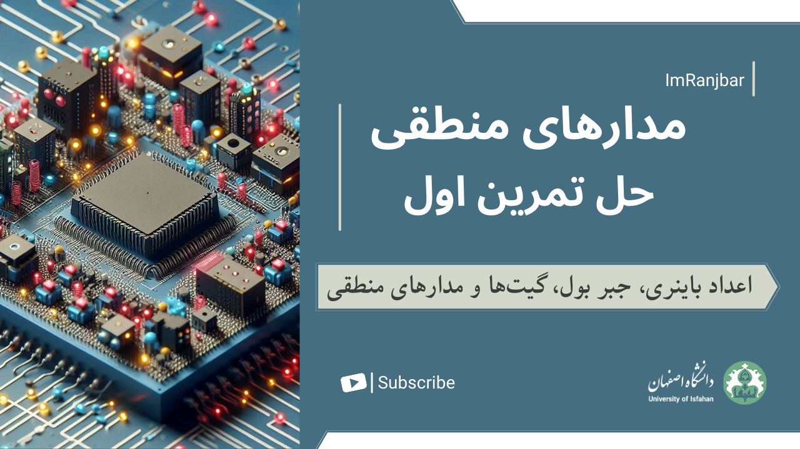

# Logic Design Course - First Assignment Walkthrough with Solutions

## Contents
* **Digital Systems and Binary Numbers**
* **Boolean Algebra and Logic Gates**

Video Content: [Watch the video](https://youtu.be/p2hh7y8Emts)

