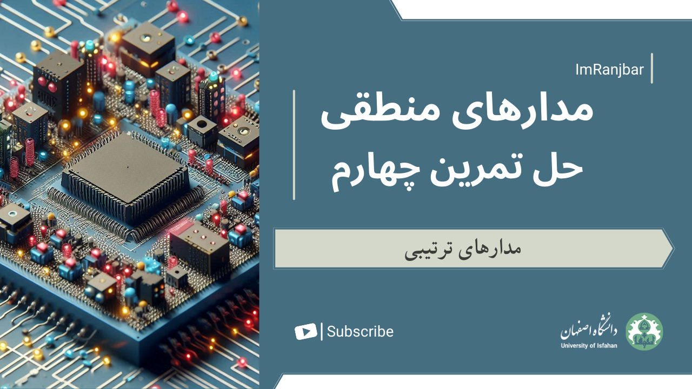

# Logic Design Course - Fourth Assignment Walkthrough with Solutions

## Contents
* **Sequential Logic**

## Contents
* **Sequential Circuits**
* **Storage Elements**
* **Synchronous and Asynchronous Counter**

Video Content: [Watch the video](https://youtu.be/RA_w0Fx3To0)

